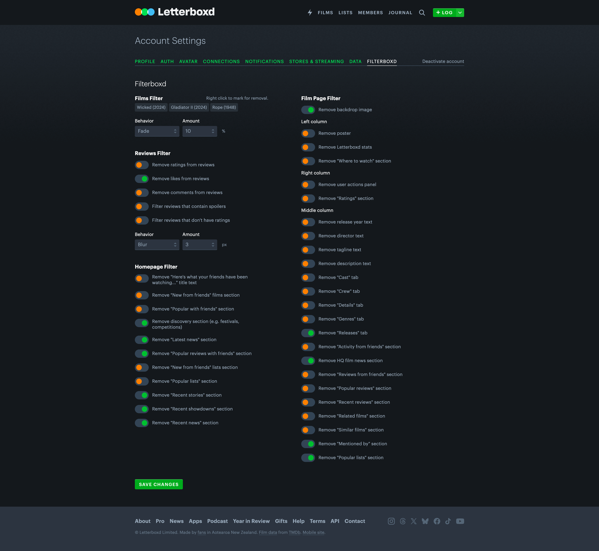

  

# Filterboxd

This is a [userscript](https://openuserjs.org/about/Userscript-Beginners-HOWTO) to filter content on [Letterboxd](https://letterboxd.com).

## Features

- [x] Filter films throughout the site

- [x] Easily add or remove films in multiple places

- [x] Filter reviews with spoilers

- [x] Customize how the filters work in settings

- [x] Remove sections from the homepage and film page

## Usage

1. Install a userscript manager like [Tampermonkey](https://www.tampermonkey.net), [Violentmonkey](https://violentmonkey.github.io), or [Greasemonkey](https://addons.mozilla.org/en-US/firefox/addon/greasemonkey/)
1. Go to [GreasyFork](https://greasyfork.org/en/scripts/519719-filterboxd) or [OpenUserJS](https://openuserjs.org/scripts/blakegearin/Filterboxd)
1. The userscript will open in your userscript manager where you can install it
1. Once installed, go here to view its configuration: [https://letterboxd.com/settings/?filterboxd](https://letterboxd.com/settings/?filterboxd)

## Screenshots

  

  

  

## Credit

- Colors, icons, and element properties for theming were collected from [Letterboxd](https://letterboxd.com)

- Local storage: [GM_config](https://github.com/sizzlemctwizzle/GM_config)

Not affiliated with Letterboxd Limited, The Movie Database, TiVo Platform Technologies LLC, or any of their affiliations.
